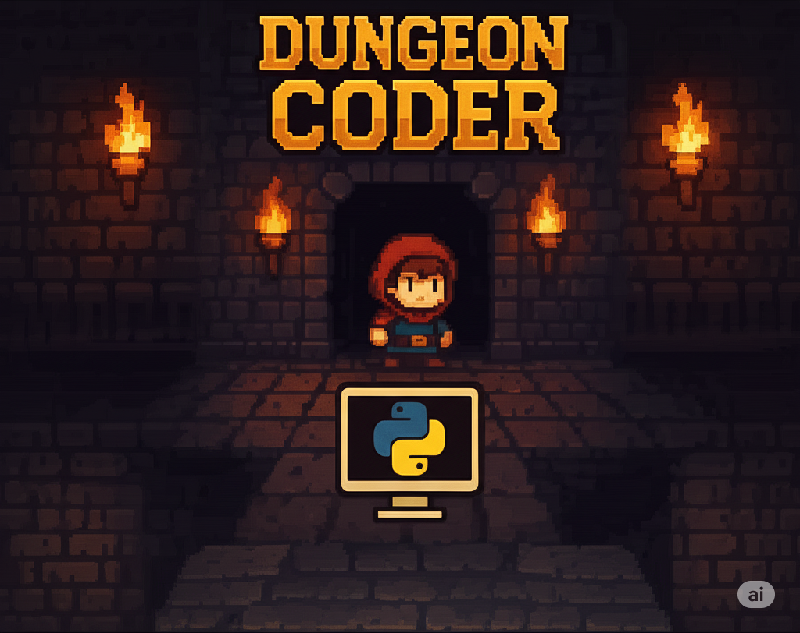

# Dungeon Coder

A VS Code extension in which you steer a hero through a pixel-art dungeon **with a Python program**. The game runs in a VS Code tab; your script sends it commands such as `hero.move()` over a local REST API and gets answers such as `True` or `False`. It was built for a first-semester course on computational thinking at Munich University of Applied Sciences, where the exercises train both programming and critical thinking: predict before you run, test on levels you haven't seen, measure instead of believing.



## Using it

**Install:** Python 3.10+ (developed on 3.15), VS Code 1.102+, the VS Code Python extension, and this extension: **Dungeon Coder** (`hm-benidiet.vscode-dungeon-coder`) from the Marketplace. Version 0.2 is a pre-release: on the extension's page, choose **Switch to Pre-Release Version** (and **Switch to Release Version** to go back to 0.1).

**First program**, in a folder opened in VS Code:

1. In a virtual environment: `pip install dungeoncoder` (the Python package, [on PyPI](https://pypi.org/project/dungeoncoder/), same version as the extension). Without internet access, command palette (`Ctrl/Cmd+Shift+P`) → **Dungeon Coder: Copy Python API to workspace** puts a copy into the folder instead.
2. Command palette → **Dungeon Coder: Enter the dungeon**. The game opens in a tab and listens on `http://127.0.0.1:3000`.
3. Write a level as text (`karte.txt`; `#` wall, `.` floor, `H` hero, `Z` exit) and a script, and run it:

```text
style: station
start: east
---
######
#H...#
#...Z#
######
```

```python
from dungeoncoder import Game

game = Game("karte.txt")          # a text map, or a Tiled level (.json)
hero = game.get_hero()
while not hero.is_collision_in_front():
    hero.move()
print(game.get_statistics()["moves"])
```

The extension brings only free pictures: a demo pack and four worlds (`station`, a hospital ward; `studio`, a light studio; `werkstatt`, a factory floor; `gelaende`, a survey area). Text maps and `Game.generate(..., style=...)` name one of them; the pixel-art dungeon of the course at Munich University of Applied Sciences comes as its own asset pack (setting `dungeonCoder.assetPacks`, below).

**The hero only senses the field in front of it** (`is_collision_in_front()`, `is_abyss_in_front()`, `is_switch_in_front()`, `is_torch_in_front()`, `is_enemy_in_front()`, `is_at_goal()`, `get_items_at_position()`, …) and acts with `move()`, `turn_left()`, `interact()`, `pickup(name)`, `drop(name)`. There is deliberately no `turn_right()` and no `get_position()`: building those yourself is part of the learning. Every method has a docstring; `help(hero)` lists them. Business outcomes never raise: a blocked step returns `False`.

**More in the game:** while a program runs, the cell a sensor looked at lights up for a moment (green: yes, white: no), and in levels with `show_calls: true` a list of the last calls (`move()  ✓`, `is_switch_in_front()  → False`) sits in the tab's corner (key **L** shows or hides it in any level). The Explorer has a **Dungeon Coder Levels** view: one click loads a level; the ▶▶ button over a Python file runs it on several levels in the simulator; the status bar shows moves and turns.

**Without VS Code:** `dungeoncoder.use_simulator()` (or `DUNGEONCODER_SIM=1`) runs the same script in a pure-Python simulator of the game's rules: no window, no waiting, the same answers. That is what automatic grading and `pytest` use (`dungeoncoder.testing.spiel(map_text)` gives `(game, hero)` for a test).

**Traces and the command line:** `game.save_trace("spur.json")` (or `DUNGEONCODER_TRACE=spur.json`) writes every call with its answer and the level itself.

```text
python -m dungeoncoder                          setup check
python -m dungeoncoder load LEVEL [--seed N]    load a level into the game
python -m dungeoncoder variants PROG LEVEL...   run a program on several levels in the simulator (--traces DIR)
python -m dungeoncoder replay TRACE             watch a trace in the game
python -m dungeoncoder trace TRACE              list a trace with the hero's field after each call
```

**Settings:**

| Setting | Default | Meaning |
|---|---|---|
| `dungeonCoder.assetPacks` | `[]` | folders with asset packs (tilesets, images, text-map styles), searched before the extension's own pictures; relative paths start at the workspace folder |
| `dungeonCoder.findAssetPacks` | `["dungeon-coder-assets"]` | asset packs found without a setting: a folder with one of these names and a `pack.json` in the opened folder, any folder above it, or a folder directly inside it (the Python package looks in and above the current folder and the script's, unless `DC_ASSET_PACKS` is set) |
| `dungeonCoder.port` | `3000` | the API port; scripts in the workspace find it through `.dungeoncoder-port` (or `DUNGEONCODER_PORT`) |

## Levels and asset packs

- **Levels** are [Tiled](https://www.mapeditor.org/) maps (JSON), or text maps that `Game("x.txt")` turns into one. Map properties switch on the game's mechanics: `fog` (`explored`/`dark`), `keyboard: false`, `win` (`all_sweets`, `all_switches`, `sorted`, `stable`), `inventory_size`, `hero_inventory`, `fernrohr`, `orakel`, `amulett` (`hero.sense_goal()`: the exit's distance as the crow flies), `max_moves` (a move budget: one call too many and the hero collapses), `show_sensing: false` (no frames around the cells a sensor looked at), `show_calls: true` (the list of the program's last calls in the tab's corner; off otherwise, key **L** shows or hides it), and more; text maps write them as header lines. `Game.generate(kind="maze")` builds a maze, a new one each time (the seed is printed; `seed=` repeats it); a text map with the header `generate: maze` and `seed: random` does the same from a file. **Variants:** objects with the property `region` lie anywhere in their `Region` rectangle: `Game("x.json", seed=17)` (text maps: `region: s 2,2 17,13`); the end screen shows the seed. **Co-op:** further heroes are `Character` objects named `Hero2`, `Hero3`, … (text maps: `2`, `3`, `4`); `game.get_heroes()` gives them all, heroes block each other, `win: all_heroes` wants each on an exit.
- **Asset packs** hold the pictures: a folder with `tilesets/`, `images/`, optionally `styles/` (text-map styles) and a `pack.json`. A tile's class (`Torch`, `Switch`, `Door`, `Goal`, `Abyss`, …) and its properties (`collision`, `state`, `item`) give it its rules, so a pack can redraw the whole game without touching levels or code. A pack's manifest `pack.json` gives its `name` and `version`, `engine` (the oldest Dungeon Coder that draws it correctly: the extension warns at game start if a configured pack needs a newer one), the `styles` and `worlds` it brings, and the tiles of the items the engine creates itself, the start inventory (`hero_inventory`) and the crystals and pebbles of text maps: `"items": {"Pebble": {"tileset": "x.json", "tile": 20}, "Crystal": {...}, "Crystal:orange": {...}}`; the first pack that names an item wins. The free **demo pack** in `packs/demo/` (CC0, drawn by `tools/make_demo_pack.py`, 16 px and 32 px tiles) shows the format. A level whose tilesets no pack has is refused with a message naming the missing tileset, and the pack if the level names it (map property `pack`). How the engine works inside: [ARCHITECTURE.md](ARCHITECTURE.md).

## Developing

**Prerequisites:** Node.js 18+ and npm, VS Code 1.102+, Python 3.

```bash
npm install
npm run compile         # development build -> dist/extension.js (also: watch, package)
npm run lint            # eslint on src, game/src, game/test, tools
npm run test:engine     # unit tests of the game's rules in Node (no browser, demo pack)
npm run compile-tests   # type check
npm run check:version   # package.json, dungeoncoder.__version__ and openapi.yaml agree
npm run build:wheel     # the Python package dungeoncoder as a wheel -> out/wheel/
npm run test:download   # once: VS Code for the integration tests -> ~/.cache/vscode-test
npm test                # integration tests in a real VS Code (src/test/)
```

`compile`, `watch` and `package` first run `npm run generate`, which derives from **`api/openapi.yaml`, the single source of truth for the REST API**: `game/src/commands.js` (command registry and route table for both servers), `src/generated/api-types.d.ts`, `game/src/api-config.js` and `api/python/dungeoncoder/_api_config.py`. Only the last one is committed (a `pip install` from git can't run the generator). The low-level Python client `api/python/dungeoncoder/_generated/` is committed (students need no code generator); regenerate it after changing the spec with `npm run generate:python-client` (creates its own venv in `.codegen-venv/`). `npm test` runs the VS Code test runner on `test-fixtures/side-by-side/exercise`, an exercise folder whose `.vscode/settings.json` names an asset pack by a relative path: it starts the game and loads a level of that pack over the REST API.

**The Python package** lives in `api/python/` (`pyproject.toml`) and has the extension's version. Install it with `pip install dungeoncoder` (PyPI), or from a wheel built by `npm run build:dist` (`RELEASING.md`). The command "Copy Python API to workspace" still copies it into a workspace (offline use); a copied folder sits next to the scripts and wins over an installed package.

**Run in VS Code:** press **F5** (needs the recommended extension `amodio.tsl-problem-matcher`; without it the window may report "Extension host did not start in 10 seconds"), or `code --extensionDevelopmentPath="$PWD" <folder>` after `npm run compile`. Close the game tab of an installed Dungeon Coder first, since both use port 3000. For the game canvas, use "Developer: Open Webview Developer Tools".

**Run in a browser** (faster loop, no VS Code):

```bash
DC_PORT=3100 DC_ASSET_PACKS=packs/demo npm run dev:browser
# open http://127.0.0.1:3100/index.html, then run scripts with
DUNGEONCODER_PORT=3100 python my_script.py
```

The dev server serves the same REST API and game page as the extension and relays to the browser tab over a WebSocket on port 8000 (fixed, so one dev server at a time).

### Layout

| Path | What |
|---|---|
| `src/extension.ts` | extension host: webview, REST server (Express), settings, commands |
| `game/src/` | the game (ES modules): `game.js` loop and states, `level.js` layers and rules, `character.js` hero and the API facade with statistics, `game-objects.js` objects, `fog.js`, `assets.js` pack lookup, `rendering/` drawing only |
| `game/test/` | Node unit tests for the rules (`npm run test:engine`) |
| `api/openapi.yaml` | the REST API |
| `api/python/dungeoncoder/` | the Python package: `dungeoncoder.py` (`Game`, `Hero`), `sim.py` (simulator), `asciimap.py` (text maps), `generator.py` (mazes), `testing.py` (pytest), `packs/` (the CC0 worlds' text-map styles, tile rules of the free tilesets, `items.json`: the bundled assets' items; `learn/`: the styles' recipes, not shipped) |
| `packs/demo/` | the CC0 demo pack |
| `tools/` | code generators, the dev server, `make_demo_pack.py`, `make_world_art.py` |
| `tools/levels/` | level tools for anyone building levels (Python; tilesets from `DC_ASSET_PACKS`, then `game/assets`): `level2ascii.py` (a level as a text map), `level2png.py` (a level as a picture, with grid, marks and paths; needs Pillow), `check_level.py` (check a level by the game's rules; with two levels: did only the look change?), `run_sim.py` (run a script in the simulator), `run_headless.py` (run a script against the dev server in headless Chrome; needs Playwright); `learn_styles.py` (learn text-map style packs from hand-built levels by JSON recipes in a `learn/` folder; `npm run learn:styles`); their shared model `dclevel.py` takes walls and abysses from the simulator, so the rules exist once; `npm run test:tools` checks them on the demo pack |

### Adding an API command

1. Add the path to `api/openapi.yaml`, then `npm run generate`.
2. Add a handler in `game/src/script.js` (`HANDLERS`) and the logic in `CharacterInterface` or the engine. Both servers create routes from the spec; only a command that needs special handling after success gets an entry in their `afterSuccess` tables.
3. `npm run generate:python-client`, then a wrapper method with a docstring in `api/python/dungeoncoder/dungeoncoder.py`.
4. **Port the rule to the simulator** (`sim.py`, a `cmd_<operationId>` method) and check that game and simulator answer every call the same way.
5. Add a unit test in `game/test/`, and a CHANGELOG entry.

## Licence

Code: MIT (`LICENSE.txt`). Demo pack and the four worlds' pictures: CC0, drawn by `tools/make_demo_pack.py` and `tools/make_world_art.py` (`packs/demo/LICENSE.md`). Based on Dungeon Coder 0.1 by Benedikt Dietrich, Munich University of Applied Sciences.
